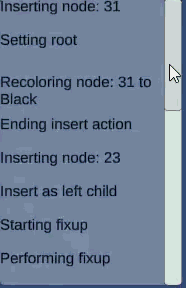

# UnityRedBlackTreeSim

Basic simulator for Red Black trees in Unity. The simulator goes through the steps of inserting/deleting nodes form a tree. 
The sim is controlled via the UI. Possible actions are:
  - Step foward
  - Step backward
  - Step foward automatically
    - Speed is controlled via slider
      
The simulator shows all changes inside of a log box in the corner of the window.

Simulator can insert/delete multiple nodes at a time.

Insert example.

Deletion example.

The simulator can save/load a given tree state.

